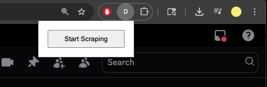

# Discord Message Scraper

Discord Message Scraper is a simple way to scrape Discord messages without interacting with the Discord API.

## Usage
This scraper is meant to be used as a chrome extension.

You can start scraping by scrolling to the bottom of a channel, and then hitting the *Start Scraping* button in the extension popup.

Once the extension is done scraping (this may take a while, as it manually scrolls through the channel), it will automatically save a file to your computer called *messages.json* with the contents of the channel.
